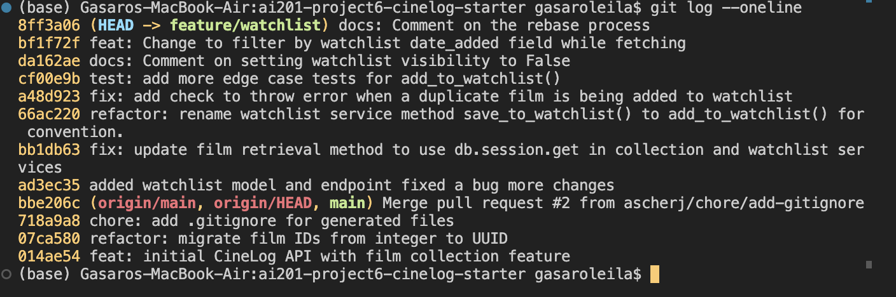

# PR Response Doc — CineLog Watchlist Feature

## AI Usage

<!-- Fill in at the end — how you used AI tools during this project -->

## Comment 1 — Rename

**What I did:** Used Ctrl + F to find all occurences of save_to_watchlist() and changed them to add_to_watchlist.
**How I verified:** Tracked down the add to watchlist route and manually verified that each point on trying to add a film to watchlist uses add_to_watchlist(). So verified from add_film function on routes/watchlist to watchlist_service. Also when importing watchlist service method, the import showed now add_to_watchlist().

## Comment 2 — Deduplication

**What I did:** Added a check to verify if a film is not already on user's watchlist. An AlreadyonWatchListError is thrown incase a film that's already on the user's watchlist is trying to be added again.
**How I verified:**Used Claude to test the POST /watchlist/<user_id>/add endpoint using curl with a duplicate film that already exists on a user's watchlist.
Process:
Had Claude first add 3 films to a user's watchlist in this format

```
Request: POST /watchlist//add
  {"film_id": 2}  Response: 201 Created
  {
      "date_added": "2026-07-15T18:09:32.606152",
      "film_id": 2,
      "id":
  "243b803e-a438-4da1-a0f9-034016230152",
      "public": true,
      "user_id":
  "921121fd-3428-40b3-9b8d-f98c4734cea1"
  }
```

Current watchlist before duplicate

```
View Watchlist

  Request: GET /watchlist/<user_id> (no body)

  Response: 200 OK
  [
      {
          "average_rating": 0.0,
          "date_added":
  "2026-07-15T18:04:14.140360",
          "director": "Christopher Nolan",
          "genre": "Sci-Fi",
          "id": 1,
          "poster_url": null,
          "public": true,
          "title": "Inception",
          "year": 2010
      },
      {
          "average_rating": 0.0,
          "date_added":
  "2026-07-15T18:09:32.606152",
          "director": "Bong Joon-ho",
          "genre": "Thriller",
          "id": 2,
          "poster_url": null,
          "public": true,
          "title": "Parasite",
          "year": 2019
      },
      {
          "average_rating": 0.0,
          "date_added":
  "2026-07-15T18:04:28.519804",
          "director": "Francis Ford Coppola",
          "genre": "Crime",
          "id": 3,
          "poster_url": null,
          "public": true,
          "title": "The Godfather",
          "year": 1972
      }
  ]
```

Now tried adding {film_id: 2} again and POST /watchlist/add responded by throwing AlreadyInWatchListError

```
Request: POST /watchlist/<user_id>/add
  {"film_id": 2}

  Response: 409 Conflict
  {"error": "Film '2' is already in this user's
  watchlist"}
```

## Comment 3 — Missing test

**What I did:**Added more tests for watchlist following the test structure of
test_add_to_watchlist_duplicate_raises
test_collection including: test_add_to_watchlist_creates_entry, test_add_to_watchlist_nonexistent_film_raises, test_add_to_watchlist_sets_default_public and test_add_to_watchlist_sets_date_added
**How I verified:**Run pytest tests/test_watchlist.py -v and the 5 watchlist test cases passed, run the whole test suite as well to verify that nothing broke and all the total 9 test cases passed.

## Comment 4 — Default visibility

**My position:**I would lean towards making it default=False
**Reasoning:**Default=False gives users who want to share it publicly the option to turn it off, but those who want to prioritize their privacy too are not forced to have just a publicly visible watchlist.
**Tradeoff acknowledged:**The only overhead this would cause is having to track user setting on this watchlist visibility, and having users take an extra step to make it visible before being able to share it with other which might reduced social engagement on the platform.

## Comment 5 — Sort order

**My position:**I would agree with defaulting to date added.
**Reasoning:**because if a user saves a film to watchlist, they wouldn’t bother knowing the name of that film because they saved it for later. So sorting by the title wouldn’t help them get what they want, but rather with the date, they would be like, “the one I added recently”
**Engagement with reviewer's point:**As explained above, I agree with the reviewers point.

## Comment 6 — Rebase

**What conflicted:**The .gitignore that was commited before didn't have .pytest_cache/ so that created a conflict. Models.py also had a conflict because of the addition of WatchListEntry model.
**How I resolved it:**Used interactive editor to accept the current changes, and at each point had to continue the rebase
**How I verified no conflict remains:**Run all tests again to verify that nothing broke. And checked VS Code's version control that no conflicts exist.

## Commit History Screenshot



## PR Description

### Summary

- Add watchlist feature allowing users to save films they want to watch later via `POST /watchlist/<user_id>/add` and view their watchlist via `GET /watchlist/<user_id>`
- Add duplicate detection that returns `409 Conflict` when a user tries to add a film already on their watchlist
- Rename `save_to_watchlist()` to `add_to_watchlist()` to match the `add_to_collection()` naming convention

### Key changes

- **`models.py`**: Added `WatchlistEntry` model with UUID primary key, `film` relationship, and `public` visibility flag (defaults to `True`)
- **`services/watchlist_service.py`**: Business logic for adding to and retrieving a user's watchlist, with `FilmNotFoundError` and `AlreadyInWatchListError` handling
- **`routes/watchlist/watchlist.py`**: Two endpoints — add to watchlist (POST) and view watchlist (GET), with proper error responses for duplicates (409) and missing films (404)
- **`services/collection_service.py`**: Updated `Film.query.get()` to `db.session.get(Film, ...)` to follow SQLAlchemy 2.0 conventions
- **`tests/test_watchlist.py`**: 6 test cases covering entry creation, duplicate prevention, nonexistent film handling, default visibility, date_added timestamp, and sort order (newest first)

### Design decisions

- Watchlist returns films sorted by `date_added` descending (most recently added first), matching how users typically think about their watchlist
- `public` defaults to `True` but could be changed to `False` to prioritize user privacy (see Comment 4)
- `WatchlistEntry.film_id` uses `String(36)` to match the UUID-based `Film.id` after the main branch refactor

### Test plan

- [ ] Run `pytest tests/test_watchlist.py -v` — all 6 tests pass
- [ ] Run full suite `pytest tests/ -v` — all 10 tests pass, no regressions
- [ ] Manual: `POST /watchlist/<user_id>/add` with `{"film_id": "<uuid>"}` returns 201
- [ ] Manual: `POST` same film again returns 409 with error message
- [ ] Manual: `GET /watchlist/<user_id>` returns films ordered newest-first
- [ ] Manual: `POST` with nonexistent film_id returns 404
